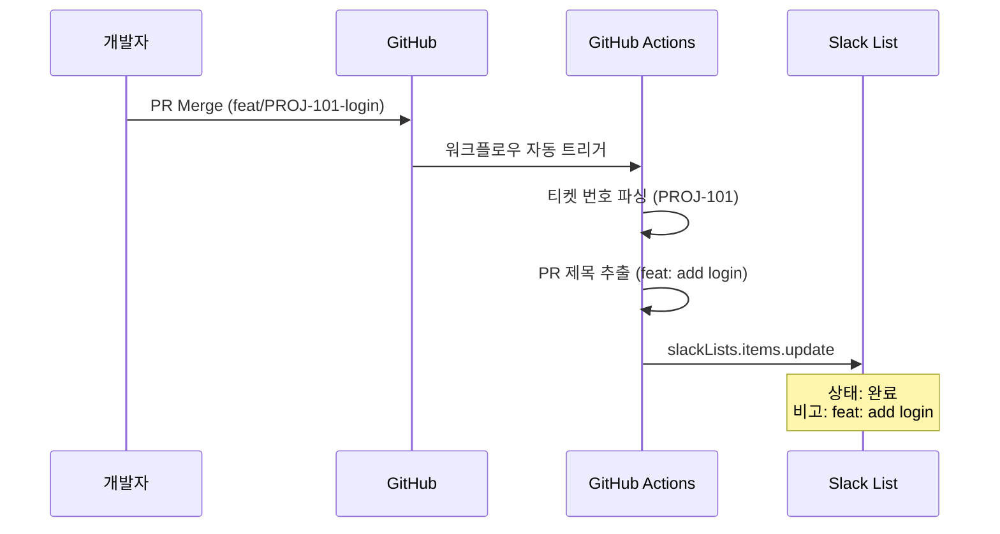
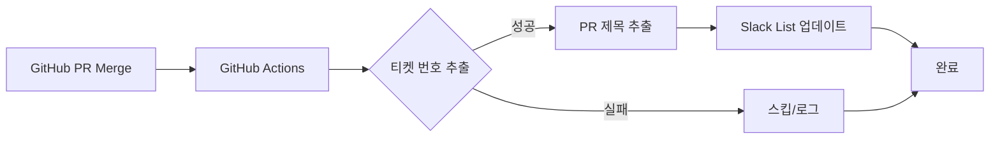

# GitHub-Slack Sync PRD

**번호**: PRD-0001
**작성일**: 2025-12-19
**우선순위**: High
**상태**: Approved (v1.1)

---

## 1. 개요

### 문제 정의

개발팀은 GitHub에서 커밋 로그로 소통하고, 비즈니스팀은 Slack에서 업무를 확인합니다. 이 과정에서 **용어의 차이**로 인해 불필요한 커뮤니케이션 비용이 발생합니다.

- "이게 무슨 뜻인가요?" - 기술 용어 이해 불가
- "어디까지 진행됐나요?" - 실시간 현황 파악 불가
- Slack 채널이 알림 메시지로 도배되는 문제

### 제안 솔루션

GitHub의 **PR Merge 이벤트**를 감지하여:
1. **티켓 번호**를 파싱하고 Slack List의 해당 항목과 매칭
2. **PR 제목**을 비고 필드에 그대로 저장
3. Slack List의 상태/설명을 **자동 업데이트** (Quiet Update, 새 메시지 발행 X)

### 예상 효과

- 개발자의 보고 시간 **100% 제거** (머지만 하면 끝)
- 비개발팀의 현황 문의 **90% 감소**
- 실시간 프로젝트 대시보드 유지

---

## 2. 목표

### 비즈니스 목표

1. 개발 현황을 **실시간**으로 비즈니스팀에 전달
2. 개발자-비개발자 간 **커뮤니케이션 비용 절감**
3. Slack 채널의 **노이즈 감소** (채팅 알림 대신 대시보드 업데이트)

### 사용자 목표

1. **개발자**: 코드 머지만으로 현황 공유 완료 (별도 보고 불필요)
2. **기획자/경영진**: 개발자에게 물어보지 않고 현황 파악
3. **마케팅팀**: 기술 용어 없이 기능 출시 현황 확인

---

## 3. 대상 사용자

| 사용자 유형 | 기술 수준 | 주요 니즈 |
|------------|----------|----------|
| **개발자** | 고급 | 별도 보고 없이 코드 집중 |
| **기획자** | 중급 | 실시간 진행 현황 확인 |
| **마케팅** | 초급 | 비기술 용어로 기능 이해 |
| **경영진** | 초급 | 한눈에 프로젝트 상태 파악 |

**예상 사용자 수**: 10-50명 (팀 규모에 따라)

---

## 4. 사용자 스토리

### US-1: 개발자의 자동 현황 공유

```
As a 개발자,
I want to PR을 머지하면 자동으로 현황이 공유되기를
So that 별도로 Slack에 들어가 "완료했습니다"라고 쓰지 않아도 됨

Acceptance Criteria:
- Given PR이 머지됨
- When 티켓 번호(PROJ-XXX)가 PR 제목/브랜치에 포함됨
- Then Slack List의 해당 항목 상태가 "완료"로 변경됨
```

### US-2: 기획자의 현황 조회

```
As a 기획자,
I want to 개발자에게 물어보지 않고 현황을 파악하기를
So that 커뮤니케이션 비용을 줄일 수 있음

Acceptance Criteria:
- Given Slack List가 존재함
- When 개발자가 PR을 머지함
- Then 1분 이내에 Slack List에 최신 상태가 반영됨
```

### US-3: 실시간 현황 확인

```
As a 팀원,
I want to PR 머지 시 Slack List가 즉시 업데이트되기를
So that 별도 질문 없이 현황을 파악할 수 있음

Acceptance Criteria:
- Given PR 메시지가 "feat: add social login"임
- When PR이 머지됨
- Then Slack List에 "feat: add social login"이 비고 필드에 표시됨
```

> **Note**: Phase 2에서 Conventional Commits 파싱으로 가독성 개선 예정

---

## 5. 기능 요구사항

### 5.1 필수 기능 (Must Have)

#### FR-1: 트리거 감지

- **설명**: GitHub에서 PR Merged 또는 Issue Closed 이벤트 발생 시 워크플로우 시작
- **수락 기준**:
  - [ ] PR Merged 이벤트 감지
  - [ ] Issue Closed 이벤트 감지
  - [ ] Webhook 또는 GitHub Actions로 트리거

#### FR-2: 티켓 번호 매칭

- **설명**: PR 제목에서 GitHub Issue 번호(`#123`) 파싱 후 Slack List 매칭
- **권장 형식**: `feat: add login #123` 또는 `fix: bug #456`
- **수락 기준**:
  - [ ] 정규식으로 Issue 번호 추출 (`#\d+`)
  - [ ] Slack List에서 해당 ID를 가진 Row 검색
  - [ ] 매칭 실패 시 Slack 알림 발송

#### FR-3: 메시지 전달 (Phase 1: 단순 전달)

- **설명**: PR 제목을 변환 없이 그대로 Slack List 비고 필드에 저장
- **Phase 로드맵**:

  | Phase | 방법 | 설명 |
  |-------|------|------|
  | **Phase 1 (MVP)** | PR 제목 그대로 전달 | 번역/변환 없음 |
  | Phase 2 (선택) | Conventional Commits 파싱 | `feat:` → `[새 기능]` 등 |
  | Phase 3 (선택) | AI 번역 | 비즈니스 친화적 요약 |

- **Phase 1 예시**:

  | PR 제목 | Slack List 비고 |
  |---------|----------------|
  | `feat(auth): add social login` | feat(auth): add social login |
  | `fix: resolve checkout error` | fix: resolve checkout error |

- **수락 기준**:
  - [ ] PR 제목 추출
  - [ ] Slack List 비고 필드에 그대로 저장
  - [ ] 특수문자 이스케이프 처리

#### FR-4: Slack List 업데이트

- **설명**: 매칭된 Slack List Row의 필드 자동 업데이트 (새 메시지 발행 X)
- **수락 기준**:
  - [x] 진행률(Progress): 프로그래스바 % 업데이트 (예: 50% → 100%)
  - [x] 비고(Description): 진행중 항목 목록으로 업데이트
  - [x] 날짜(Date): 현재 시간으로 업데이트 (KST 기준)
  - [x] **Quiet Update**: 채널에 별도 메시지 알림 없음 (기존 리스트 항목만 수정)
  - [ ] 매칭 실패 시 Slack 알림 발송

#### FR-5: Checklist 기반 진행률 계산 *(v1.1 추가)*

- **설명**: PR 본문의 Markdown Checklist를 파싱하여 진행률 자동 계산
- **수락 기준**:
  - [x] `- [x]` 완료 항목 카운트
  - [x] `- [ ]` 미완료 항목 카운트
  - [x] 진행률 = (완료 / 전체) × 100
  - [x] Checklist 없으면 100%로 처리
- **예시**:
  ```markdown
  - [x] 기능 구현
  - [x] 테스트 작성
  - [ ] 문서화
  ```
  → 진행률: 66% (2/3)

#### FR-6: 항목 자동 생성 *(v1.1 추가)*

- **설명**: Slack List에 해당 Issue 항목이 없으면 자동 생성
- **수락 기준**:
  - [x] `slackLists.items.list`로 검색
  - [x] 매칭 실패 시 `slackLists.items.create` 호출
  - [x] 제목: `#123 - PR 제목` 형식
- **API**: `slackLists.items.create`

#### FR-7: 시각적 프로그레스 바 *(v1.1 추가)*

- **설명**: 진행률을 텍스트 기반 프로그레스 바로 표시
- **수락 기준**:
  - [x] 10칸 프로그레스 바 (`█` = 완료, `░` = 미완료)
  - [x] 퍼센트 + 카운트 표시: `████░░░░░░ 60% (3/5)`
  - [x] 비고 필드에 진행중 항목 목록 표시
- **예시**:

  | 상태 | 진행률 필드 | 비고 필드 |
  |------|------------|----------|
  | 진행중 | `██████░░░░ 66% (2/3)` | 🔄 진행중: • 문서화 |
  | 완료 | `██████████ 100% (3/3)` | ✅ 모두 완료! |

### 5.2 선택 기능 (Nice to Have)

1. **다중 프로젝트 지원**: 여러 GitHub Repo → 여러 Slack List 매핑
2. **사용자 정의 프롬프트**: 팀별 톤앤매너 설정
3. **롤백 기능**: 잘못된 업데이트 되돌리기
4. **통계 대시보드**: 번역된 PR 수, 평균 반영 시간 등

---

## 6. 범위 제외 (Out of Scope)

명확히 제외되는 항목:

- **채팅 메시지 알림**: Quiet Update만 지원 (채널 도배 방지)
- **수동 Slack List 편집 기능**: 자동화만 지원
- **GitHub Issues 외 이슈 트래커**: Jira, Linear 등은 V2에서 검토
- **실시간 양방향 동기화**: GitHub → Slack 단방향만 지원
- **모바일 앱**: Slack 웹/데스크톱만 지원

---

## 7. 데이터 요구사항

### 입력 데이터

| 소스 | 데이터 | 용도 |
|------|--------|------|
| GitHub PR | Title | 티켓 번호 추출, AI 입력 |
| GitHub PR | Body | AI 입력 (상세 설명) |
| GitHub PR | Commit Messages | AI 입력 (변경 내용) |
| GitHub PR | Branch Name | 티켓 번호 추출 (백업) |

### 출력 데이터

| 대상 | 데이터 | 설명 |
|------|--------|------|
| Slack List | Status | "완료" 또는 "QA 대기" |
| Slack List | Description | AI 생성 요약문 |
| Slack List | Date | 업데이트 시간 |

### 매핑 규칙

```
티켓 ID (PROJ-XXX) ↔ Slack List Row ID
```

### 저장/보존 요구사항

- 번역 로그 7일 보존 (디버깅용)
- 실패 이벤트 30일 보존 (재처리용)

---

## 8. UI/UX 고려사항

### Slack List 구조

| 필드 | 타입 | 설명 |
|------|------|------|
| ID | Text | GitHub Issue 번호 (`#123`) |
| 업무명 | Text | 태스크 제목 |
| 진행률 | Progress (%) | 0% → 50% → 100% (프로그래스바) |
| 비고 | Text | PR 제목 (자동 업데이트) |
| 담당자 | Person | 개발 담당자 |
| 마지막 업데이트 | Date | 자동 갱신 |

### 화면 예시 *(v1.1 업데이트)*

**변경 전**:

| ID | 업무명 | 진행률 | 비고 |
|:---:|:---|:---|:---|
| #101 | 소셜 로그인 개발 | `█████░░░░░ 50% (2/4)` | 🔄 진행중: • 테스트 • 문서화 |

**변경 후** (PR 머지 시 자동 업데이트):

| ID | 업무명 | 진행률 | 비고 |
|:---:|:---|:---|:---|
| #101 | 소셜 로그인 개발 | `███████░░░ 75% (3/4)` | 🔄 진행중: • 문서화 |

### 주요 인터랙션

1. **자동 업데이트**: PR 머지 시 진행률 자동 변경 (50% → 100%)
2. **Quiet Update**: 채널에 새 메시지 없음 (기존 리스트만 수정)
3. **실패 알림**: 티켓 매칭 실패 시 Slack 알림 발송

---

## 9. 기술 고려사항

### 기술 스택 (Phase 1 MVP)

| 레이어 | 기술 | 비고 |
|--------|------|------|
| Trigger | **GitHub Actions** | PR Merge 이벤트 자동 감지 |
| Processing | **단순 파싱** | 티켓 번호 추출 + PR 제목 전달 |
| Output | Slack API (Lists) | slackLists.items.update |

> **Note**: Middleware(Zapier/Make)는 불필요. GitHub Actions가 이벤트 수신 → 데이터 처리 → API 호출을 모두 수행.

### 아키텍처 다이어그램 (Phase 1 MVP)



### 외부 의존성

| 서비스 | 용도 | 플랜 요구사항 | 월 비용 |
|--------|------|--------------|--------|
| GitHub | 이벤트 소스 + Actions | Free 이상 | **$0** |
| Slack | 리스트 업데이트 | **Pro 플랜 이상** | 별도 |

### 비용 (Phase 1)

| 항목 | 비용 |
|------|------|
| GitHub Actions | $0 |
| Middleware | $0 (불필요) |
| AI API | $0 (미사용) |
| **합계** | **$0** |

### 성능 요구사항

- **Latency**: GitHub 이벤트 발생 후 Slack 반영까지 **15초 이내** (GitHub Actions)
- **Throughput**: 동시 10건 이상 처리 가능
- **Availability**: 99.9% (GitHub Actions SLA)

### 보안 고려사항

- [x] API 키 암호화 저장 (GitHub Secrets)
- [x] Slack OAuth 토큰 안전 관리
- [x] PR 데이터 최소 수집 (민감 정보 제외)

### Column ID 설정 *(v1.1 추가, v1.2 업데이트)*

Slack List의 Column ID는 **하드코딩**되어 있습니다. 새 List 사용 시 반드시 확인 필요:

| Column | ID | 타입 | 용도 |
|--------|-----|------|------|
| 제목 | `Col0A4WG2LPHA` | rich_text | 레포지토리 이름 (owner 생략) |
| 진행률 | `Col0A55RYJHEV` | rich_text | 프로그레스 바 |
| 비고 | `Col0A4WG5SFD2` | rich_text | 진행중 항목 |
| 마지막 업데이트 | `Col0A4ZL4THPU` | date | 자동 갱신 날짜 (KST) |

**Column ID 확인 방법**:
```bash
curl -X POST "https://slack.com/api/slackLists.items.list" \
  -H "Authorization: Bearer $SLACK_USER_TOKEN" \
  -H "Content-Type: application/x-www-form-urlencoded" \
  -d "list_id=$SLACK_LIST_ID"
```

또는 PowerShell:
```powershell
powershell tests/check_list_structure.ps1
```

> ⚠️ **주의**: Column ID가 다르면 워크플로우 `.github/workflows/slack-list-sync.yml` 수정 필요

---

## 10. 성공 지표

### 정량적 지표

| 지표 | 현재 | 목표 | 측정 방법 |
|------|------|------|----------|
| 현황 보고 메시지 수 | 일 20건 | 일 2건 (-90%) | Slack 채널 메시지 카운트 |
| 현황 문의 수 | 일 10건 | 일 1건 (-90%) | "어디까지?" 키워드 검색 |
| Slack 반영 시간 | 수동 | < 1분 | 자동 로그 |

### 정성적 지표

- "개발자에게 물어볼 필요가 없어졌다" 피드백
- "Slack List만 보면 된다" 피드백
- 개발자 만족도 (별도 보고 부담 감소)

---

## 11. 마일스톤

| Phase | 설명 | 산출물 | 예상 기간 |
|-------|------|--------|----------|
| **Phase 1 (MVP)** | GitHub Actions → Slack List 직접 연동 | PR 제목 그대로 전달, E2E 동작 | 3-5일 |
| Phase 2 (선택) | Conventional Commits 파싱 | `feat:` → `[새 기능]` 가독성 개선 | 3일 |
| Phase 3 (선택) | AI 번역 추가 | 비즈니스 친화적 요약 | 5일 |

---

## 12. 결정 사항

| 항목 | 결정 | 비고 |
|------|------|------|
| **Slack 플랜** | Free 플랜 사용 | Pro 불필요 |
| **티켓 번호 형식** | `#123` (GitHub Issue 번호) | 권장: PR 제목에 `#123` 포함 |
| **상태 값** | 프로그래스바 (%) | 0% → 50% → 100% |
| **예외 처리** | 알림 발송 | 매칭 실패 시 Slack 알림 |

---

## 13. 첨부 자료

### 데이터 흐름도 (Phase 1 MVP)



### Slack List 목업 *(v1.1 업데이트)*

**업무 현황 대시보드**

| ID | 업무명 | 진행률 | 비고 | 담당자 | 업데이트 |
|:---:|:---|:---|:---|:---:|:---:|
| #101 | 소셜 로그인 개발 | `██████████ 100% (3/3)` | ✅ 모두 완료! | @김개발 | 12/22 |
| #102 | 결제 페이지 개선 | `██████░░░░ 66% (2/3)` | 🔄 진행중: • QA 테스트 | @이개발 | 12/22 |
| #103 | 버그 수정 | `██████████ 100%` | 📝 fix: session timeout | @박개발 | 12/22 |

---

## 변경 이력

| 버전 | 날짜 | 작성자 | 변경 내용 |
|------|------|--------|----------|
| 0.1 | 2025-12-19 | Claude | 초안 작성 |
| 0.2 | 2025-12-19 | Claude | 리서치 결과 반영 (Middleware 제거, 규칙 기반 번역 추가) |
| 0.3 | 2025-12-19 | Claude | Phase 1 MVP 단순화 (AI 제거, PR 제목 그대로 전달) |
| 1.0 | 2025-12-19 | Claude | 최종 확정 (Free 플랜, #123 형식, 프로그래스바 %, 실패 알림) |
| **1.1** | 2025-12-22 | Claude | **구현 반영**: FR-5 Checklist 진행률, FR-6 항목 자동 생성, FR-7 시각적 프로그레스 바, Column ID 가이드 |
